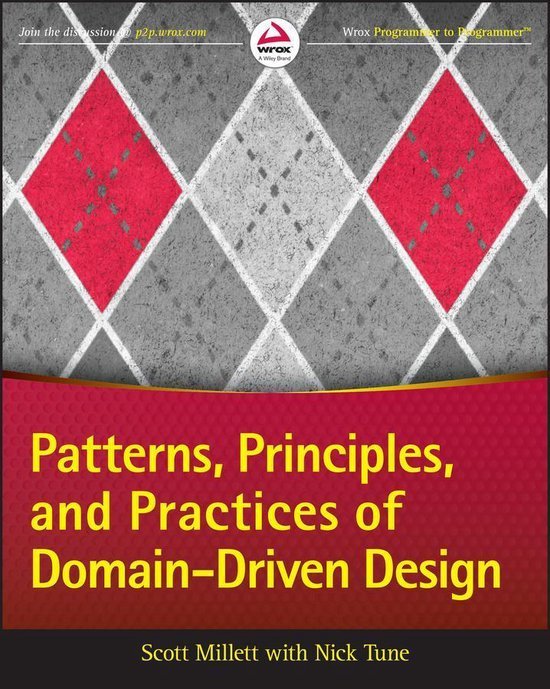
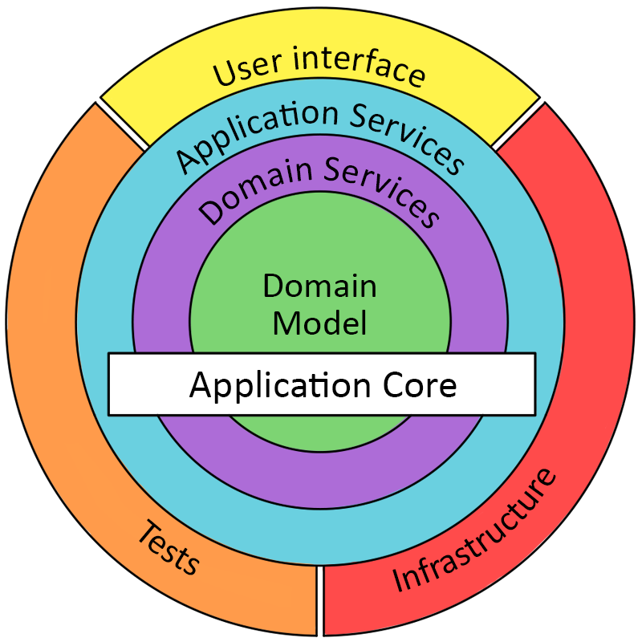
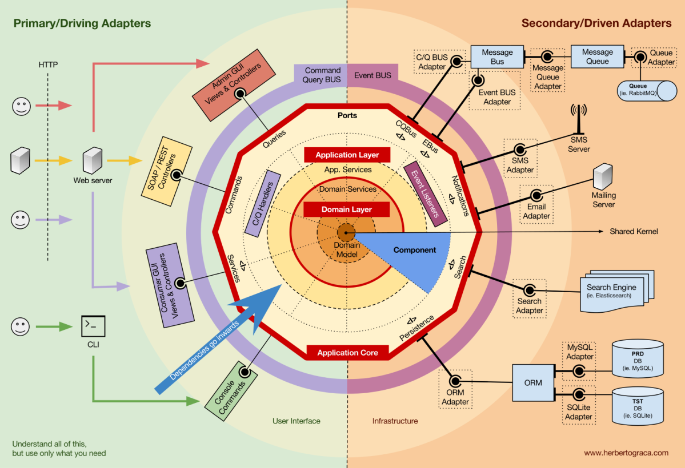
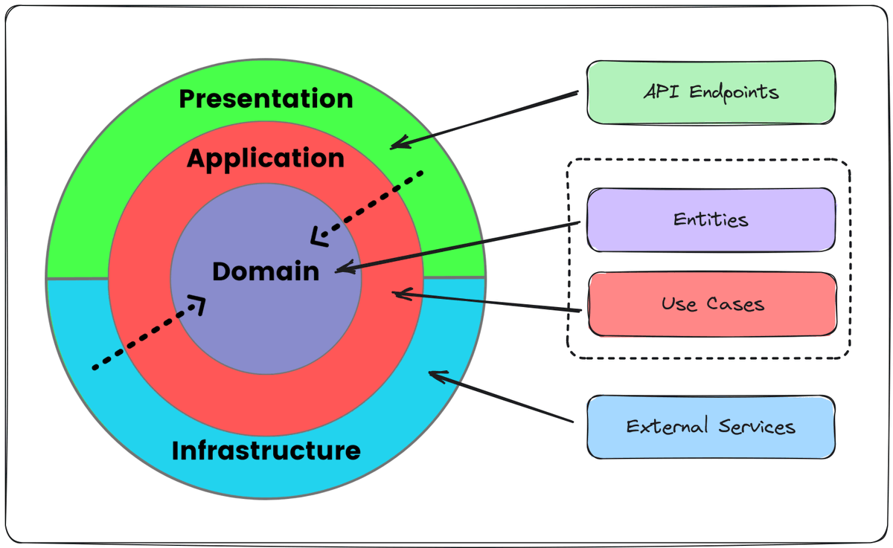

= Practice #7

*Main takeaway:* read the book below and use common sense

.plan
* [ ] A bit of common sense
* [ ] Vocabulary
** Entity
** Service
** Value object
** Repository

* [ ] Refactor HW to DDD
* [ ] Short (but important) questionnaire: https://docs.google.com/forms/d/e/1FAIpQLSfVU1s1yIL03s35dIIzFlopotRBLq40yBPTJfR5ZH9XLeiJ-g/viewform

.expand to see typical pictures from architecture books
[%collapsible]
====
.a typical picture from architecture books

.another typical picture from architecture books

.and yet another typical picture from architecture books

====
